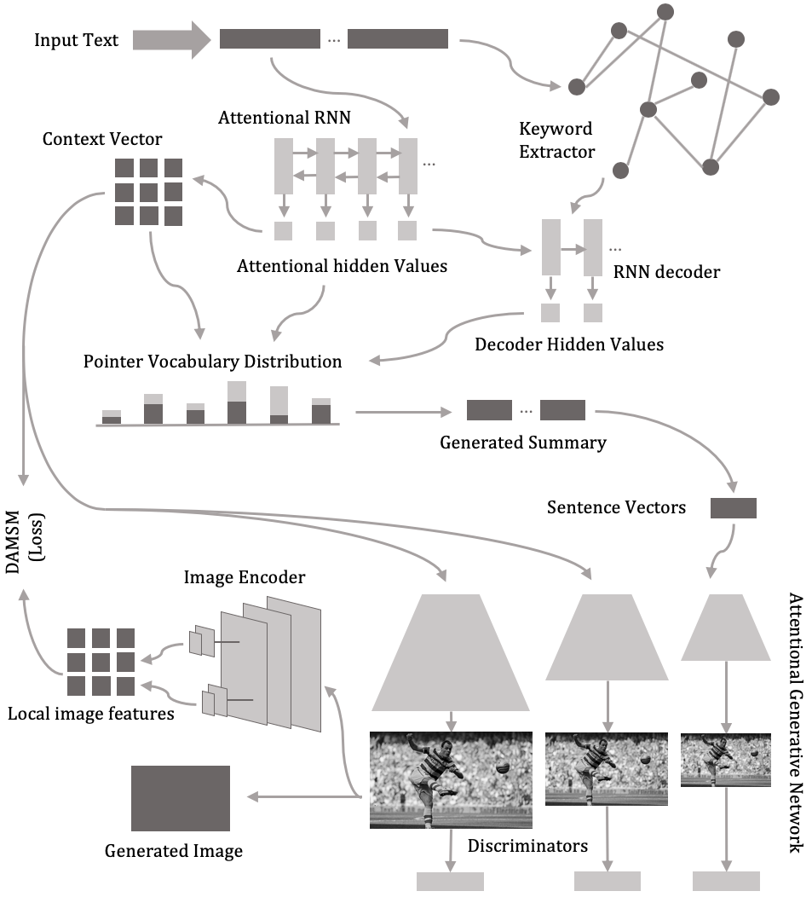

# ReDoc

pytorch implementation for ReDoc results in the paper ReDoc: Reproducing Documents to Easier-to-Understand Format with Attentional RNN summarizer and stacked image generative adversrial network by JuneKyu Park, Kyung-Ah Sohn.

